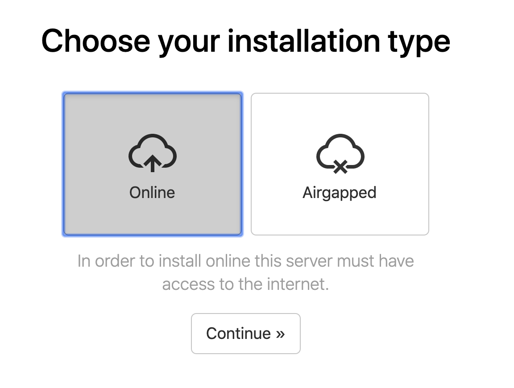
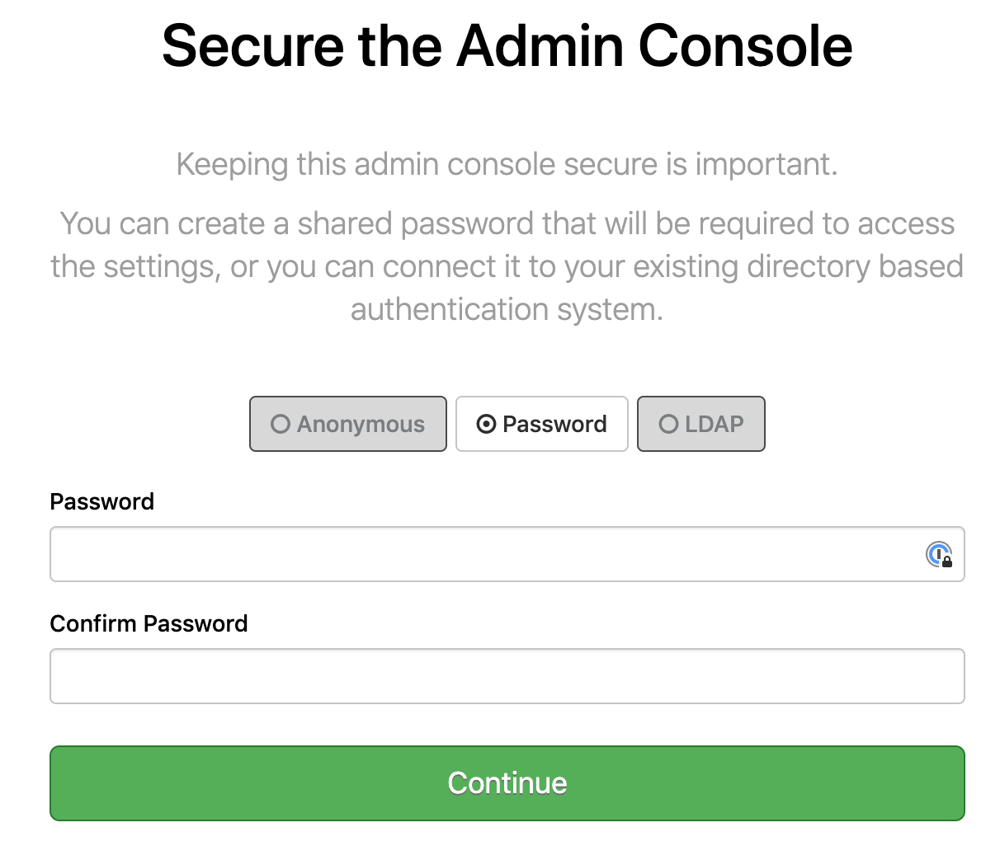

# ptfe-demo-ssc
Install PTFE on Demo version with Self Sign Certificate - vagrant

# Requirements
TFE Overview : https://www.terraform.io/docs/enterprise/index.html
Pre-INstall checklist : https://www.terraform.io/docs/enterprise/before-installing/index.html

# How To

This repository assumes general knowledge about Terraform, if not, please get yourself accustomed first by going through [getting started guide for Terraform](https://learn.hashicorp.com/terraform?track=getting-started#getting-started). We also going to use Vagrant with VirtualBox and KitchenCI.

To learn more about the mentioned above tools and technologies -  please check section [Technologies near the end of the README](#technologies)

# How to use
- Download copy of the code (*clone* in Git terminology) - go to the location of your choice (normally some place in home folder) and run in terminal; in case you are using alternative Git Client - please follow appropriate instruction for it and download(*clone*) [this repo](https://github.com/Galser/ptfe-demo-ssc.git). 
```
git clone https://github.com/Galser/ptfe-demo-ssc.git
```

- Previous step should create a folder that contains a copy of the repository. The default name is going to be the same as the name of repository e.g. `ptfe-demo-ssc`. Locate and open it.
    ```
    cd ptfe-demo-ssc
    ```
- We going to run install PTFE in virtual machine, to prepare that virtual machine please run :
    ```
    vagrant up
    ``` 
    > Command above will utilize settings from [Vagrantfile](Vagrantfile) prepared in this repo
 
    First-time start can take some time, as Vagrant need to download and import box image, and you can see something like this :
    ```
    vagrant up
    Bringing machine 'default' up with 'virtualbox' provider...
    ==> default: Importing base box 'galser/bionic64-for-ptfe'...
    ==> default: Matching MAC address for NAT networking...
    ==> default: Checking if box 'galser/bionic64-for-ptfe' version '0.0.1' is up to date...
    ==> default: Setting the name of the VM: ptfe-demo
    ==> default: Clearing any previously set network interfaces...
    ==> default: Preparing network interfaces based on configuration...
        default: Adapter 1: nat
        default: Adapter 2: hostonly
    ==> default: Forwarding ports...
        default: 22 (guest) => 2222 (host) (adapter 1)
    ==> default: Running 'pre-boot' VM customizations...
    ==> default: Booting VM...
    ==> default: Waiting for machine to boot. This may take a few minutes...
        default: SSH address: 127.0.0.1:2222
        default: SSH username: vagrant
        default: SSH auth method: private key
        default: 
        default: Vagrant insecure key detected. Vagrant will automatically replace
        default: this with a newly generated keypair for better security.
        default: 
        default: Inserting generated public key within guest...
        default: Removing insecure key from the guest if it's present...
        default: Key inserted! Disconnecting and reconnecting using new SSH key...
    ==> default: Machine booted and ready!
    ==> default: Checking for guest additions in VM...
    ==> default: Setting hostname...
    ==> default: Configuring and enabling network interfaces...
    ==> default: Mounting shared folders...
    default: /vagrant => /Users/../ptfe-demo-ssc
    ```
- Login to you fresh VM , to do so execute : 
    ```
    vagrant ssh
    ```
    You should see : 
    ```
    Welcome to Ubuntu 18.04.2 LTS (GNU/Linux 4.15.0-55-generic x86_64)

    * Documentation:  https://help.ubuntu.com
    * Management:     https://landscape.canonical.com
    * Support:        https://ubuntu.com/advantage
    ```
- Now, from a shell on your instance:
    - To execute the installer directly, run 
    ```bash
    curl https://install.terraform.io/ptfe/stable | sudo bash
    ```
    - To inspect the script locally before running, run 
    ```bash
    curl https://install.terraform.io/ptfe/stable > install.sh
    ```
    and, once you are satisfied with the script's content, execute it with 
    ```bash
    sudo bash install.sh
    ```

>Note The installation will take a few minutes and you'll be presented with a message about how and where to access the rest of the setup via the web at the end.   This will be [http://192.168.56.22:8800](http://192.168.56.22:8800).  For the guidelines on the possible questions during this portion of the setup, see the next section. 

### Example of the terminal (shell) part of the installation and possible questions 
- Start of the installation : 
    ```bash
    sudo bash install.sh 
    Determining local address
    The installer was unable to automatically detect the private IP address of this machine.
    Please choose one of the following network interfaces:
    [0] enp0s3	10.0.2.15
    [1] enp0s8	192.168.56.22
    [2] docker0	172.17.0.1
    ```
    At the screen above, installer is not able to correctly choose private IP address, you need to choose. For our example the correct one is number [1]
- Proceed with it :
    ```bash
    Enter desired number (0-1): 1
    The installer will use network interface 'enp0s8' (with IP address '192.168.56.22').
    Determining service address
    The installer was unable to automatically detect the service IP address of this machine.
    Please enter the address or leave blank for unspecified.
    Service IP address: 192.168.56.22
    ```
    And again , supply the address `192.168.56.22`
- Continue :     
    ```bash
    Does this machine require a proxy to access the Internet? (y/N) n
    ```
    Well, this answer depends from your local setup, but in our case is "NO", so we entering `n`
- Continuation, there going to be no more questions, installation nis going to continue for several minutes :
    ```bash
    Installing docker version 18.09.2 from https://get.replicated.com/docker-install.sh
    # Executing docker install script, commit: UNKNOWN
    + sh -c apt-get update -qq >/dev/null
    + sh -c apt-get install -y -qq apt-transport-https ca-certificates curl >/dev/null
    + sh -c curl -fsSL "https://download.docker.com/linux/ubuntu/gpg" | apt-key add -qq - >/dev/null
    Warning: apt-key output should not be parsed (stdout is not a terminal)
    + sh -c echo "deb [arch=amd64] https://download.docker.com/linux/ubuntu bionic stable" > /etc/apt/sources.list.d/docker.list
    + [ ubuntu = debian ]
    + sh -c apt-get update -qq >/dev/null
    INFO: Searching repository for VERSION '18.09.2'
    INFO: apt-cache madison 'docker-ce' | grep '18.09.2.*-0~ubuntu' | head -1 | cut -d' ' -f 4
    + _status=0
    + [ -n 5:18.09.2~3-0~ubuntu-bionic ]
    + sh -c apt-get install -y -qq --no-install-recommends docker-ce-cli=5:18.09.2~3-0~ubuntu-bionic >/dev/null
    ...
    ```
- And it all should end with  : 
    ```bash
    Digest: sha256:76dfb558e0de6ba6f90e0725b36e53b04044b04b9b350efc12eede0cccea1275
    Status: Downloaded newer image for quay.io/replicated/replicated-operator:stable-2.39.0
    Tagging replicated-operator image
    Stopping replicated-operator service
    Installing replicated-operator service
    Starting replicated-operator service
    Created symlink /etc/systemd/system/docker.service.wants/replicated-operator.service → /etc/systemd/system/replicated-operator.service.

    Operator installation successful

    To continue the installation, visit the following URL in your browser:

    http://192.168.56.22:8800
    ```
## Web-based portion of the installation
- Open your favorite browser and access the link that had been presented to you at the previous step : [Web-stage of PTFE installation](http://192.168.56.22:8800). You going to see the page :

Press **[Continue to Setup]**
- As we using self-signed certificates for this project, you will see a security warning when first connecting. **This is expected and you'll need to proceed with the connection anyway.** And later we are going to change that address to a proper FQDN form, this one: `192.168.56.22.xip.io`
- Now you will be presented with settings screen :

Where you will need to enter hostname: `192.168.56.22.xip.io` and press button **[Use Self-Signed Cert]**
- You need to confirm security warning of the browser once more, as we just had changed the URL through  which we accesing our PTFE installation. Please do so and proceed. 
- Now you will need to present your license file. Usually, it comes in a special tar-ball package with extension RLI. Press [Choose license] , Locate the file and upload. 

- Next screen allows you to select between *Online* and *airgapped* installation. Choose **[Online]** :

And press **[Continue]** button
- On the next step, you will need to enter the password, that can be used in the future to access THIS, Admin Console : 

Enter the desired password, and press continue
- Now you will see the "Preflight Checks", when all the main requirements for the PTFE installation checked and presented to you the top of the screen looks like : 

Once more, press **[Continue]** button
- The next screen presents all your settings in one place : 

Check them visually, scroll down to the **Installation Type** section and select **[Demo]**
After that =  press **[Save]** button at the bottom of the page
press **[save]** button to save all you settings. And you going to be present with the following informational screen : 

 Press **[Restart Now]** 
- At his moment PTFE will do a full start of all internal services, it can take a couple of minutes, refresh the windows from time to time :

  > Note:..Depending on your browser and/or browser settings the starting in the left part of Dashboard - never changes unless you reload the page. So force-reload the page after 2-3 minutes. 
- Wait a couple of minutes for the state at the left rectangle to be changed to **Started**. Now, below the button [Stop now] there is link **[Open]** :
    
    Open it, this will lead you to the first-time setup of the admin user :
- Set up your admin user : 
    
    Fill in the form and press **[Create an account]**
- Now you are logged in the brand fresh Private Terraform Enterprise. Congratulations.


# TODO


# DONE
- [x] define objectives as we go
- [x] prepare vagrant vm
- [x] prepare step-by step instructions for installation part
- [x] update README

# notes

# Technologies

1. **To download the content of this repository** you will need **git command-line tools**(recommended) or **Git UI Client**. To install official command-line Git tools please [find here instructions](https://git-scm.com/book/en/v2/Getting-Started-Installing-Git) for various operating systems. 
2. **For managing infrastructure** we using Terraform - open-source infrastructure as a code software tool created by HashiCorp. It enables users to define and provision a data center infrastructure using a high-level configuration language known as Hashicorp Configuration Language, or optionally JSON. More you encouraged to [learn here](https://www.terraform.io). 
3. **This project for virtualization** recommends **VirtualBox**, download the binaries for your [platform here](https://www.virtualbox.org/wiki/Downloads) and then follow [instructions for installation](https://www.virtualbox.org/manual/ch02.html)
4. **For managing VM** (virtual machines), we are going to use **Vagrant**. To install **Vagrant** , please follow instructions here : [official Vargant installation manual](https://www.vagrantup.com/docs/installation/)
5. **Terraform Enterprise** - is HashiCorp's self-hosted distribution of Terraform Cloud. It offers enterprises a private instance of the Terraform Cloud application, with no resource limits and with additional enterprise-grade architectural features like audit logging and SAML single sign-on.
*Terraform Cloud* is an application that helps teams use Terraform together. It manages Terraform runs in a consistent and reliable environment, and includes easy access to shared state and secret data, access controls for approving changes to infrastructure, a private registry for sharing Terraform modules, detailed policy controls for governing the contents of Terraform configurations, and more. You can read more [here](https://www.terraform.io/docs/enterprise/index.html)
